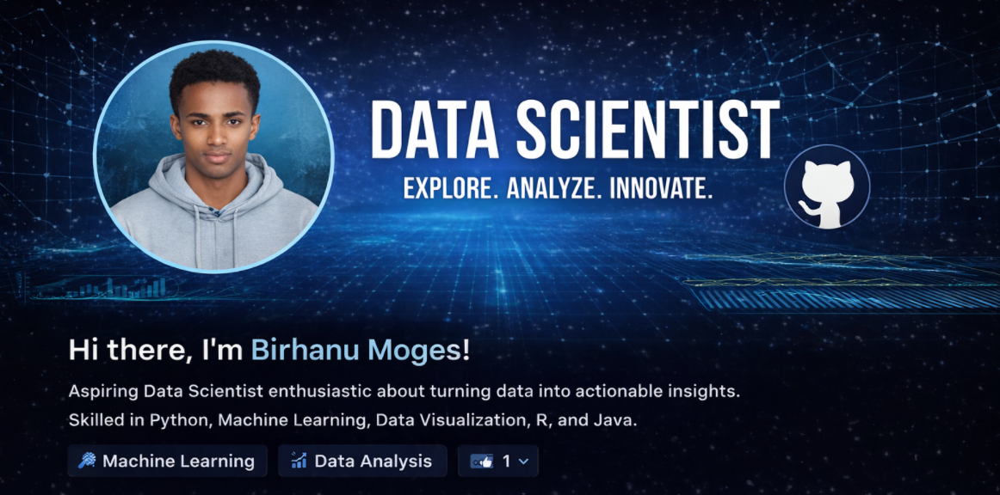

##  Hi, I'm a Data Scientist

 **Aspiring Data Scientist | Machine Learning | Data Analysis | AI**
 Passionate about turning data into actionable insights and building intelligent systems.

---

##  About Me

*  Interested in **Data Science, Machine Learning, and AI**
*  Experience with **data analysis, visualization, and modeling**
*  Love working on **real-world datasets and research-oriented projects**
*  Currently learning advanced **ML, Deep Learning, and Cloud tools**

---

##  Skills & Tools

###  Programming Languages

* Python 🐍
* R 📈
* Java ☕
* SQL 🗄️

###  Data Science & ML

* Pandas, NumPy
* Scikit-learn
* TensorFlow / PyTorch (basic)
* Statistics & Probability

###  Visualization

* Matplotlib
* Seaborn
* Power BI / Tableau (basic)

###  Tools & Platforms

* Git & GitHub
* Jupyter Notebook
* RStudio
* VS Code

---

##  GitHub Stats

---

##  Featured Projects

### 🔹 Data Analysis Projects

* 📈 Exploratory Data Analysis (EDA)
* 📊 Statistical analysis on real datasets

### 🔹 Machine Learning

*  Classification & Regression models
*  Anomaly Detection

### 🔹 Spatial & Time-Series Analysis

*  GIS & spatial pattern analysis
*  Time-series forecasting

>  *More projects coming soon — stay tuned!*

---

##  Learning & Research Interests

* Machine Learning & Deep Learning
* Big Data & Cloud Computing
* Anomaly Detection Systems
* Spatial & Geospatial Data Science

---

##  Connect With Me

* 💼 LinkedIn: *(add your link here)*
* 📧 Email: *(add your email here)*
* 🌐 Portfolio: *(optional)*

---

⭐ **If you like my work, feel free to follow me and star my repositories!**

> *Explore • Analyze • Innovate* 🚀

