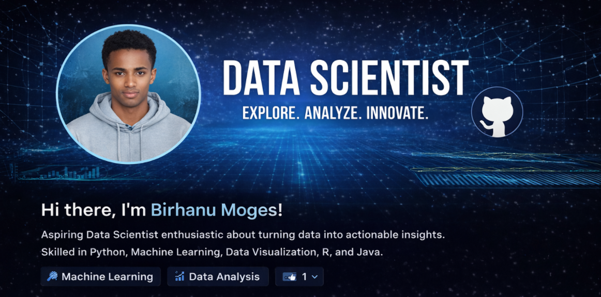

---

<table>
  <tr>
    <!-- About Me text on left -->
    <td>

### About Me
I am a data science enthusiast with experience in **Java development**, **machine learning** (including deep learning and computer vision), and **predictive modeling**. I enjoy exploring complex datasets, building models, and creating insightful visualizations. My goal is to turn data into actionable insights.

    </td>

    <!-- Banner image on right -->
    <td>
      
    </td>
  </tr>
</table>

---

## Skills & Tools

### Programming Languages

### Data Science & ML

### Visualization

---

## GitHub Stats

---

## Connect With Me

  
  
  

---

**If you like my work, feel free to follow me and star my repositories!**
