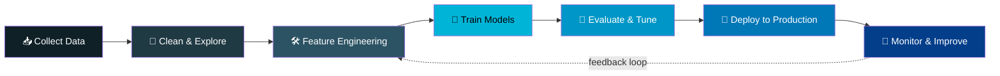
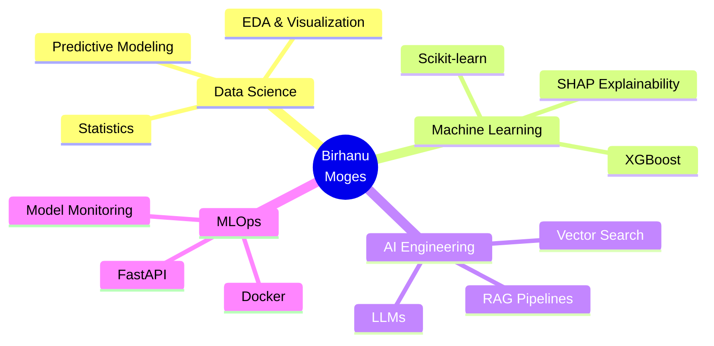

---
<table>
<tr>
<td width="55%" valign="middle">

### 🚀 About Me

- 🔭 I'm a **Data Scientist / AI & ML Engineer** passionate about turning raw data into real-world impact.
- 🧠 Skilled in **Python**, **Machine Learning**, **Deep Learning**, and **Predictive Modeling**.
- 📊 I love exploring complex datasets, engineering features, and building models that actually ship.
- 🤖 Currently deep into **LLMs, RAG pipelines, and MLOps**.
- 🌱 Always learning — from classic statistics to the latest in generative AI.

</td>
<td width="45%">

</td>
</tr>
</table>

 

 

## 🔄 How I Work — From Data to Deployment

```mermaid
flowchart LR
    A["📥 Collect Data"] --> B["🧹 Clean & Explore"]
    B --> C["🛠️ Feature Engineering"]
    C --> D["🤖 Train Models"]
    D --> E["📏 Evaluate & Tune"]
    E --> F["🚀 Deploy to Production"]
    F --> G["📡 Monitor & Improve"]
    G -.->|feedback loop| C

    style A fill:#0f2027,color:#fff
    style B fill:#203a43,color:#fff
    style C fill:#2c5364,color:#fff
    style D fill:#00b4d8,color:#000
    style E fill:#0096c7,color:#fff
    style F fill:#0077b6,color:#fff
    style G fill:#023e8a,color:#fff
```

 

## 🧩 My Core Focus Areas

```mermaid
mindmap
  root((Birhanu<br/>Moges))
    Data Science
      Statistics
      EDA & Visualization
      Predictive Modeling
    Machine Learning
      Scikit-learn
      XGBoost
      SHAP Explainability
    AI Engineering
      LLMs
      RAG Pipelines
      Vector Search
    MLOps
      Docker
      FastAPI
      Model Monitoring
```

##  Skills & Tools
###  Programming Languages
<!-- Skills Section -->

  <!-- Python Badge -->
  

  <!-- R Badge -->
  

  <!-- Java Badge -->
  

  <!-- SQL Badge -->
  

  <!-- JavaScript Badge -->

  <!-- HTML Badge -->
  

  <!-- CSS Badge -->
  

###  Data Science & ML

### Visualization
&nbsp;
&nbsp;
&nbsp;

---

##  GitHub Stats

---

##  Connect With Me

  
  
  

---
 **If you like my work, feel free to follow me and star my repositories!**
